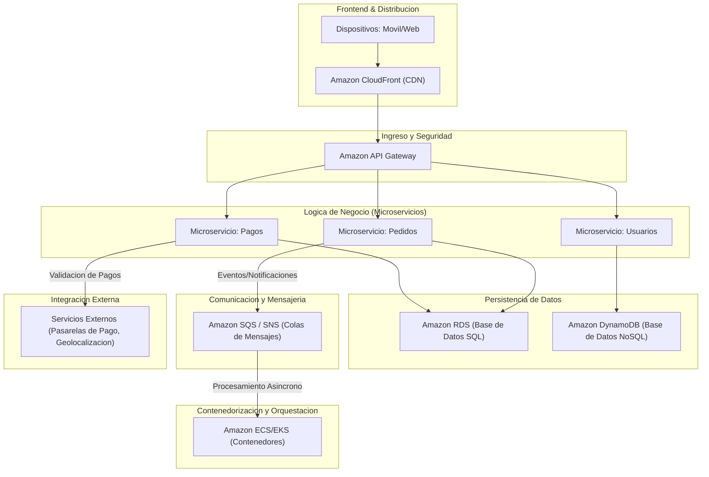
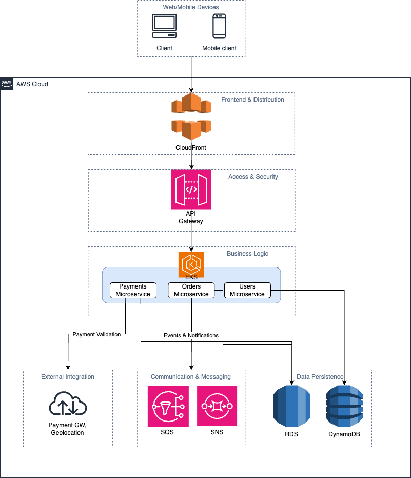

# delivery-app

## Diseño Completo del Sistema para Aplicación de Delivery

### 1. Visión General del Sistema

La aplicación de delivery se compone de múltiples componentes que se integran para brindar una solución escalable, resiliente y segura. Los elementos clave son:

- **Aplicación Móvil/Web:** Interfaz de usuario intuitiva que permite a los clientes realizar pedidos, visualizar el estado del pedido en tiempo real y gestionar pagos.
- **CDN (Content Delivery Network):** Distribuye contenido estático a nivel global, reduciendo la latencia y mejorando el rendimiento.
- **API Gateway:** Punto de entrada centralizado que enruta las solicitudes hacia los microservicios, manejando autenticación, autorización y control de tráfico.
- **Microservicios:** Conjunto de servicios independientes (Pedidos, Usuarios, Pagos, etc.) que encapsulan la lógica de negocio y se comunican mediante APIs REST/GraphQL y mensajería asíncrona.
- **Persistencia de Datos:** Empleo de bases de datos relacionales (SQL) para transacciones críticas y bases de datos NoSQL para datos de alta velocidad (por ejemplo, geolocalización y seguimiento de pedidos).
- **Servicios Externos:** Integraciones con pasarelas de pago, APIs de geolocalización y otros proveedores especializados.
- **Infraestructura en la Nube:** Desplegada en AWS para garantizar alta disponibilidad, escalabilidad automática, replicación de datos y tolerancia a fallos.

---

### 2. Diseño del Frontend

**Tecnologías y Estrategia:**

- **Framework:** Utilización de frameworks modernos como React, Angular o Vue, según las preferencias y experiencia del equipo.
- **Diseño Responsivo:** Implementación de un diseño mobile-first y uso de frameworks CSS (por ejemplo, Bootstrap o TailwindCSS) para garantizar que la interfaz se adapte a dispositivos móviles y de escritorio.
- **Experiencia de Usuario (UX):**  
  - Interfaz limpia e intuitiva con transiciones suaves y feedback inmediato.
  - Optimización de recursos mediante técnicas como lazy loading y optimización de imágenes.
  - Integración con CDN para distribuir contenido estático de forma rápida.

---

### 3. Diseño del Backend

**Arquitectura de Microservicios:**

- **Separación de Responsabilidades:**  
  Cada microservicio se encarga de una función específica:
  - **Pedidos:** Gestión de las órdenes de delivery.
  - **Usuarios:** Administración de perfiles, autenticación y autorización.
  - **Pagos:** Procesamiento y validación de transacciones.

- **Persistencia de Datos:**
  - **Amazon RDS (SQL):** Maneja datos transaccionales críticos, garantizando la integridad y consistencia (ej., registros de usuarios y pagos).
  - **Amazon DynamoDB (NoSQL):** Gestiona datos de alta velocidad y gran volumen, como el seguimiento en tiempo real de pedidos y datos de geolocalización.

- **Comunicación e Integración:**
  - **APIs REST/GraphQL:** Permiten la comunicación síncrona entre servicios y con el frontend.
  - **Mensajería Asíncrona:** Uso de colas de mensajes (Amazon SQS / SNS) para desacoplar procesos y manejar picos de carga.
  - **Patrones de Resiliencia:** Implementación de circuit breakers y estrategias de retry para evitar fallos en cascada.

- **Integración con Servicios Externos:**
  - **Pasarelas de Pago:** Integración con proveedores como Stripe o PayPal para el procesamiento seguro de pagos.
  - **Geolocalización:** Uso de APIs externas (como Google Maps) para obtener rutas y datos de ubicación en tiempo real.

---

### 4. Infraestructura y Escalabilidad

**Infraestructura en AWS:**

- **Amazon CloudFront (CDN):** Distribuye el contenido estático de la aplicación globalmente para reducir la latencia.
- **Amazon API Gateway:** Punto de entrada para las solicitudes, centralizando el enrutamiento y la seguridad.
- **Application Load Balancer (ALB):** Distribuye el tráfico entre las instancias de microservicios, asegurando la alta disponibilidad.
- **VPC en Multi-AZ:** Aisla la infraestructura en un entorno virtualizado, distribuyendo los recursos en múltiples zonas de disponibilidad para tolerancia a fallos.
- **Contenedorización y Orquestación:**  
  - **Amazon ECS/EKS:** Orquesta y gestiona contenedores que alojan los microservicios, facilitando el despliegue, escalabilidad y mantenimiento.
- **Monitoreo y Logging:**  
  - **Amazon CloudWatch:** Recolecta métricas, logs y establece alertas para una monitorización proactiva.
- **Mensajería:**  
  - **Amazon SQS / SNS:** Facilita la comunicación asíncrona entre microservicios, desacoplando los procesos internos.

**Estrategias de Escalabilidad y Resiliencia:**

- **Auto-escalado:** Configuración de políticas de escalado horizontal y vertical para frontend (mediante CDNs y balanceadores) y backend (contenedores orquestados).
- **Alta Disponibilidad:** Uso de múltiples zonas de disponibilidad, replicación de bases de datos y balanceadores de carga.
- **Seguridad:**  
  - Cifrado TLS en tránsito y cifrado en reposo en bases de datos.
  - Autenticación y autorización robustas (OAuth2, JWT).
  - Segmentación de red, firewalls y auditorías de seguridad.

---

### 5. Preguntas Clave para la Evaluación

- **Alta Disponibilidad y Tolerancia a Fallos:**  
  *Respuesta esperada:* Uso de múltiples zonas de disponibilidad, balanceadores de carga, replicación de bases de datos y mecanismos de failover, junto con monitoreo proactivo y alertas.

- **Estrategias de Escalado:**  
  *Respuesta esperada:* Escalado horizontal y vertical utilizando auto-escalado en la nube, contenedorización (Docker, Kubernetes/ECS/EKS) para el backend, y CDNs para el frontend.

- **Mecanismos de Seguridad:**  
  *Respuesta esperada:* Implementación de cifrado TLS y en reposo, autenticación y autorización robustas, firewalls, segmentación de red y auditorías regulares.

- **Comunicación entre Microservicios:**  
  *Respuesta esperada:* Uso de APIs REST/GraphQL, colas de mensajes (SQS/SNS), circuit breakers y comunicación asíncrona para lograr una arquitectura desacoplada y mantenible.

- **Caching y Uso de CDN:**  
  *Respuesta esperada:* Uso de caches a nivel de aplicación (Redis, Memcached) y CDNs para distribuir contenido estático, además de estrategias de invalidación de cache para datos dinámicos.

---

### 6. Diagrama de Arquitectura en AWS (Tentativo)

 
 
 

